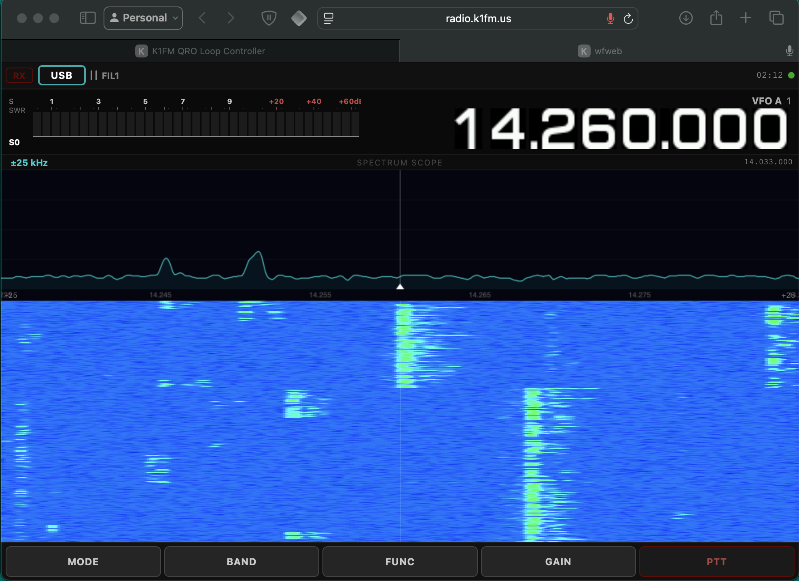
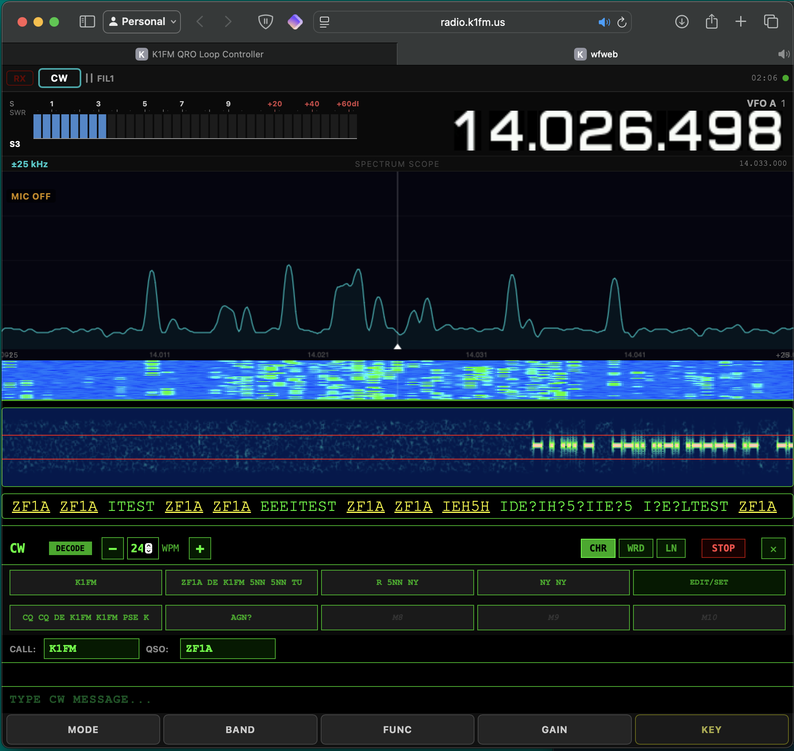

# wfweb

**wfweb** is a fork of [wfview](https://gitlab.com/eliggett/wfview) that adds a built-in web interface for browser-based remote control and real-time audio streaming. It is aimed at users who want to operate their radio from a phone, tablet, or any browser — without installing any client software.

---

## About wfview

wfview is an outstanding open-source front-end for Icom, Kenwood, and Yaesu amateur radio transceivers. Written in C++/Qt by Elliott H. Liggett W6EL, Phil E. Taylor M0VSE, and contributors, it provides a rich desktop GUI with waterfall display, full radio control, audio over LAN, rigctld emulation, and much more. It is one of the most capable and well-engineered radio control applications available for Linux, macOS, and Windows.

The wfview project is hosted on GitLab:
**https://gitlab.com/eliggett/wfview**

Since wfview is on GitLab and wfweb is on GitHub, GitHub's native fork mechanism cannot be used. This repository is a maintained fork that tracks upstream wfview and adds the web interface layer on top.

---

## What wfweb adds

| Feature | wfview | wfweb |
|---|:---:|:---:|
| Desktop GUI (Qt) | ✓ | ✓ |
| Full radio control (CI-V, LAN) | ✓ | ✓ |
| Waterfall display | ✓ | ✓ |
| Audio over LAN | ✓ | ✓ |
| Built-in HTTP/WebSocket server | — | ✓ |
| Browser-based remote control | — | ✓ |
| Browser RX audio streaming | — | ✓ |
| Browser TX audio (mic to rig) | — | ✓ |
| Mobile-responsive UI | — | ✓ |
| Headless / no-display operation | — | ✓ |

## Screenshots

| SSB | CW with decoder |
|:---:|:---:|
|  |  |

The web interface is served directly by the `wfview` binary over HTTPS (self-signed certificate). No separate web server is needed. Connect your radio, run `wfview` (the binary retains the upstream name), and open `https://<host>:8080` in any browser. On first visit, accept the browser's certificate warning.

---

## Quick start (headless, IC-7300 via USB)

Install the package, then create a configuration file:

```ini
# ~/.config/wfview/wfview.conf

[Program]
hasRunSetup=true
version=0.1.0

[Radio]
Manufacturer=0
RigCIVuInt=148
SerialPortRadio=auto
SerialPortBaud=115200

[LAN]
AudioOutput=hw:CARD=CODEC,DEV=0
AudioInput=hw:CARD=CODEC,DEV=0
```

Then run:

```bash
wfview
```

Open your browser at `https://<host>:8080`.

### Key configuration parameters

| Key | Section | Description | Example |
|---|---|---|---|
| `hasRunSetup` | `[Program]` | Skip first-time setup dialog | `true` |
| `Manufacturer` | `[Radio]` | 0=Icom, 1=Kenwood, 2=Yaesu | `0` |
| `RigCIVuInt` | `[Radio]` | CI-V address (decimal). IC-7300=148 (0x94) | `148` |
| `SerialPortRadio` | `[Radio]` | Serial port, or `auto` | `/dev/ttyUSB0` |
| `SerialPortBaud` | `[Radio]` | Baud rate | `115200` |
| `AudioOutput` | `[LAN]` | ALSA device for RX audio (rig→browser) | `hw:CARD=CODEC,DEV=0` |
| `AudioInput` | `[LAN]` | ALSA device for TX audio (browser→rig) | `hw:CARD=CODEC,DEV=0` |

Use `aplay -l` and `arecord -l` to list available ALSA devices on your system.

---

## Building from source

### Dependencies

| Library | Version | License | Purpose |
|---|---|---|---|
| Qt5 | ≥ 5.12 | LGPLv3 | Application framework, UI, networking |
| Qt5 WebSockets | same | LGPLv3 | WebSocket server for web interface |
| libopus | any | BSD 3-Clause | Audio codec for LAN streaming |
| libportaudio | any | MIT | Cross-platform audio I/O |
| libpulse | any | LGPLv2.1 | PulseAudio support (Linux) |
| librtaudio | any | MIT | Cross-platform audio (non-Linux) |
| libhidapi | any | BSD/GPLv3 | USB HID for gamepad controllers |
| QCustomPlot | 2.x | GPLv3 | Waterfall and spectrum plots |
| Speex resampler | any | BSD 3-Clause | Audio sample rate conversion |
| Eigen | 3.x | MPL2 | Linear algebra (CW decoder) |
| ggmorse | any | MIT | Morse code decoding (compiled to WebAssembly for the web frontend) |
| openssl | any | Apache-2.0 | **Runtime only:** generates the self-signed TLS certificate on first launch, required for HTTPS and browser microphone access |

See [INSTALL.md](INSTALL.md) for full build instructions.

---

## License

wfweb is licensed under the **GNU General Public License v3.0**, the same as wfview. As a derivative work, this is required.

See [LICENSE](LICENSE) for the full text.

All third-party components retain their original licenses:
- Qt5 components are used under the LGPLv3 — wfweb links dynamically and makes no modifications to Qt itself.
- QCustomPlot is used under GPLv3, compatible with this project.
- Speex resampler, libopus, libportaudio, librtaudio, Eigen: see their respective notices in `src/audio/resampler/` and the About box in the application.

---

## Upstream relationship

wfweb tracks the upstream wfview `master` branch. The intent is to keep the delta small so that merging upstream improvements remains straightforward. Changes in wfweb are limited to:

- `src/webserver.cpp` / `include/webserver.h` — web server implementation
- `resources/web/` — web frontend (HTML/CSS/JS)
- `resources/web.qrc` — Qt resource file for the web frontend
- Minor changes to `src/wfmain.cpp` for web server initialization
- This README and branding strings only (binary name and config path unchanged)

---

## Disclaimer

wfweb is provided "as is", without warranty of any kind. See the [LICENSE](LICENSE) for full terms.

This software is intended for use by licensed amateur radio operators in accordance with the regulations of their country. The user is solely responsible for ensuring that their operation complies with all applicable laws and licence conditions, including but not limited to permitted frequencies, power levels, and modes of operation. The authors accept no liability for unlicensed or non-compliant use.

---

## Credits

Full credit for the radio control engine, audio subsystem, waterfall, and everything else that makes this software work goes to the wfview authors and contributors:

- Elliott H. Liggett, W6EL
- Phil E. Taylor, M0VSE
- Roeland Jansen, PA3MET
- Jim Nijkamp, PA8E
- And the entire wfview community

Please consider supporting the original project at **https://wfview.org** and **https://www.patreon.com/wfview**.
